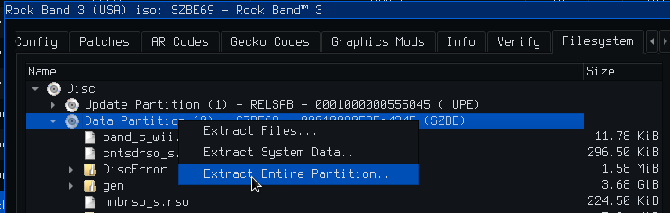

Rock Band 3 [![Build Status]][actions] [![Code Progress]][progress] [![Data Progress]][progress]
=============

[Build Status]: https://github.com/DarkRTA/rb3/actions/workflows/build.yml/badge.svg
[actions]: https://github.com/DarkRTA/rb3/actions/workflows/build.yml
[Code Progress]: https://img.shields.io/endpoint?label=Code&url=https%3A%2F%2Fprogress.decomp.club%2Fdata%2Frb3%2FSZBE69%2Fdol%2F%3Fmode%3Dshield%26measure%3Dcode
[Data Progress]: https://img.shields.io/endpoint?label=Data&url=https%3A%2F%2Fprogress.decomp.club%2Fdata%2Frb3%2FSZBE69%2Fdol%2F%3Fmode%3Dshield%26measure%3Ddata
[progress]: https://hmxmilohax.github.io/RB3DX-Site/decomp.html

A decompilation of Rock Band 3 (USA).

This repository does **not** contain any game assets or assembly whatsoever. An existing copy of the game is required.

Dependencies
============

Windows:
--------
- Install [Python](https://www.python.org/downloads/) and add it to `%PATH%`.
  - Also available from the [Windows Store](https://apps.microsoft.com/store/detail/python-311/9NRWMJP3717K).
- Download [ninja](https://github.com/ninja-build/ninja/releases) and add it to `%PATH%`.
  - Quick install via pip: `pip install ninja`
- (Optional) Run `Add-Exclusion.ps1` (Right click -> "Run with PowerShell") to avoid degraded performance from Windows Defender scans.

macOS:
------
- Install [ninja](https://github.com/ninja-build/ninja/wiki/Pre-built-Ninja-packages):
  ```
  brew install ninja
  ```
- Install [wine-crossover](https://github.com/Gcenx/homebrew-wine):
  ```
  brew install --cask --no-quarantine gcenx/wine/wine-crossover
  ```

After OS upgrades, if macOS complains about `Wine Crossover.app` being unverified, you can unquarantine it using:
```sh
sudo xattr -rd com.apple.quarantine '/Applications/Wine Crossover.app'
```

Linux:
------
- Install [ninja](https://github.com/ninja-build/ninja/wiki/Pre-built-Ninja-packages).
- For non-x86(_64) platforms: Install wine from your package manager.
  - For x86(_64), [wibo](https://github.com/decompals/wibo), a minimal 32-bit Windows binary wrapper, will be automatically downloaded and used.

Building
========

- Clone the repository:
  ```
  git clone https://github.com/DarkRTA/rb3.git
  ```
- Using [Dolphin Emulator](https://dolphin-emu.org/), extract your game to `orig/SZBE69`.

- Configure:
  ```
  python configure.py
  ```
- Build:
  ```
  ninja
  ```

Diffing
=======

Once the initial build succeeds, an `objdiff.json` should exist in the project root.

Download the latest release from [encounter/objdiff](https://github.com/encounter/objdiff). Under project settings, set `Project directory`. The configuration should be loaded automatically.

Select an object from the left sidebar to begin diffing. Changes to the project will rebuild automatically: changes to source files, headers, `configure.py`, `splits.txt` or `symbols.txt`.


